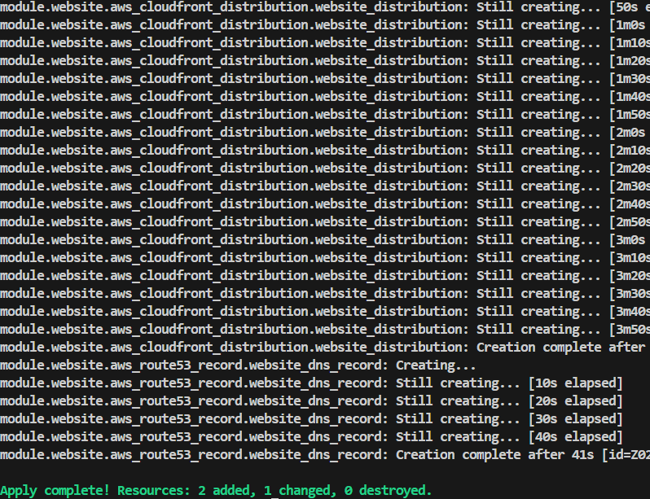
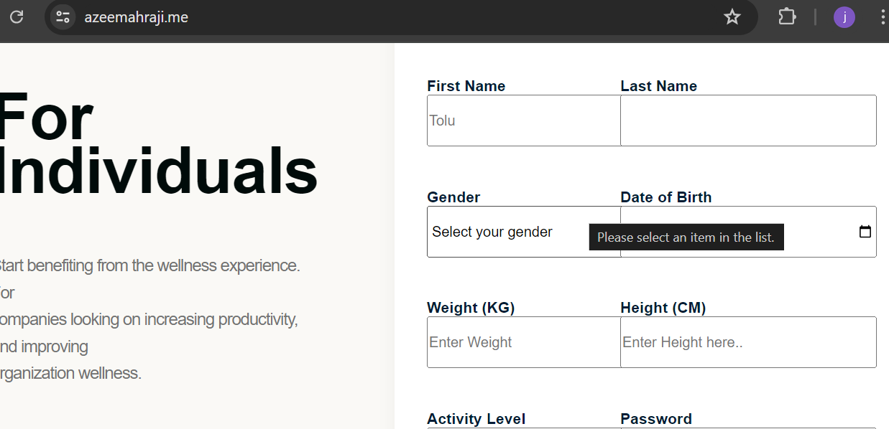

## Prerequisites:
AWS account

Domain name registered in Route53

## Steps:
- Install terraform [Terraform](https://developer.hashicorp.com/terraform/install)
- Run `terraform init` to initialize terraform back ends
- Create `s3.tf` in your `/modules` configuring;
     
  - S3 bucket to host the website
  - Bucket policy to make it publicly accessible
  - Define the index.html and error.html as thr default documents
  - upload website files into it

- Create `cloudfront.tf` in `/modules`;

  - to create cloudfront distribution to serve the content from the s3 bucket
  - account verification needed to create this (optional)
  - configure the default_root_object to point to index.html
  - integrate the SSL certificate for HTTPS

- `acm.tf` in `/modules`;

  - request and validate an SSL certificate

- `route53.tf` in `/modules`;

  - configure route 53 to manage custom domain
  - create DNS records to point to the cloudfront distribution

- Create an IAM roles and policies to secure the s3 bucket and cloudfront distribution.

  - create IAM user
  - create policy, import code from the `terraform_iam_policy.json`
  - create access keys
  - install aws cli (if not installed)
  - save the access key and secret key in the `.aws/credentials` alternatively, `aws configure`

- run `terraform plan` to view output of the configuration
- run `terraform apply -var-file config/dev.tfvars` specifying where the var file is as the argument

- verify the deployment by accessing the website via the custom domain

